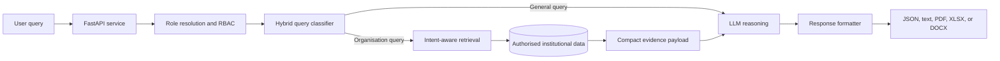

# OrganicMind

### Enterprise Knowledge Agent for real-time, access-aware answers

*Turning organisation-specific records into concise, role-appropriate responses without exposing data an individual should not see.*

## Overview

**OrganicMind** is an agentic AI framework designed to connect a conversational LLM to private, structured organisational knowledge. The current academic pilot focuses on Moodle-style academic data, allowing students, faculty, and administrators to ask natural-language questions about information such as attendance, grades, courses, mentors, and contacts.

Rather than sending every request straight to an LLM, the agent resolves the caller's role, classifies the request, retrieves only authorised evidence, and then produces a grounded answer. General questions take a lightweight LLM path; organisation-specific questions take an access-controlled retrieval path first.

> [!NOTE]
> This repository is currently the project documentation hub. The reports below describe the evaluated Phase 1 proof of concept and its reference API; implementation sources are being consolidated separately.

## Architecture

The access check happens before data enters the LLM context. This keeps information controls deterministic and auditable instead of relying on prompt instructions alone.

## Key capabilities

| Capability | What it does |
| --- | --- |
| **Hybrid intent routing** | Combines LLM classification with a deterministic heuristic fallback so requests can be routed reliably. |
| **Role-based access control** | Applies student, faculty, and administrator visibility rules at retrieval time. |
| **Intent-aware retrieval** | Maps academic requests to focused handlers for profiles, grades, attendance, mentors, courses, contacts, and more. |
| **Grounded response synthesis** | Gives the response model a compact, structured evidence payload for organisation-specific answers. |
| **Multi-format output** | Supports inline JSON plus downloadable text, PDF, Excel, and Word responses in the evaluated prototype. |
| **Resilient agent flow** | Falls back to keyword-based classification when the primary model result is unavailable or invalid. |

## Reference stack

| Layer | Technology used in the evaluated prototype |
| --- | --- |
| API | Python, FastAPI, Uvicorn |
| Agent reasoning | Groq API with LLaMA 3.1 8B Instant for classification and LLaMA 3.3 70B Versatile for synthesis |
| Data access | pandas over structured CSV data with a JSON mentor-assignment store |
| Security | Retrieval-layer RBAC with role-aware payload construction |
| Document generation | TXT, PDF, XLSX, and DOCX response formatters |
| Delivery | Docker and Render cloud deployment |

## Prototype results

The research paper reports results from an 80-query academic benchmark and RBAC verification tests:

| Measure | Result |
| --- | ---: |
| End-to-end intent accuracy | **91.3%** |
| General vs. organisation routing accuracy | **95%** |
| Median organisation-query latency | **1.84 s** |
| Median general-query latency | **1.51 s** |
| RBAC verification | **30 / 30** expected access-control outcomes |

Read the methodology and evaluation details in the [research paper](docs/academic/research-paper.pdf).

## Reference API surface

The production proof of concept described in the research paper exposes the following endpoints:

| Method | Endpoint | Purpose |
| --- | --- | --- |
| `GET` | `/health` | Liveness check |
| `GET` | `/user-context/{user_id}` | Resolve user role and profile context |
| `POST` | `/ask` | Submit a natural-language request |
| `POST` | `/mentor/assign` | Perform an administrator-only mentor assignment |

## Documentation

Project documents are intentionally kept out of the repository root so they remain easy to find and extend.

| Document | Description |
| --- | --- |
| [Phase 1 synopsis](docs/academic/phase-1-synopsis.pdf) | Project objectives, functional requirements, methodology, and the original system architecture. |
| [Research paper](docs/academic/research-paper.pdf) | Architecture, implementation details, experimental evaluation, limitations, and future work. |
| [Documentation guide](docs/README.md) | Folder structure and naming conventions for future project materials. |

## Roadmap

- [x] Define the agent workflow and reference architecture
- [x] Demonstrate hybrid routing, structured retrieval, and role-aware responses
- [x] Evaluate request classification, latency, and access control
- [ ] Add semantic retrieval for unstructured institutional content
- [ ] Introduce session-scoped multi-turn context
- [ ] Move from prototype storage to a production-grade database
- [ ] Publish the consolidated implementation and deployment guide

## Team

Built as a Final Year B.E. project at the Department of Information Science and Engineering, Nitte Meenakshi Institute of Technology.

- P. Parker Vijay Harshan
- Palak Pandit
- P. Charan Prashanth
- Abhay Rawat

Guided by Dr. Sudhir Shenai.

## Project status

Phase 1 is complete as a documented proof of concept. The next repository milestone is to add the implementation source, environment configuration, tests, and deployment instructions alongside this documentation.
